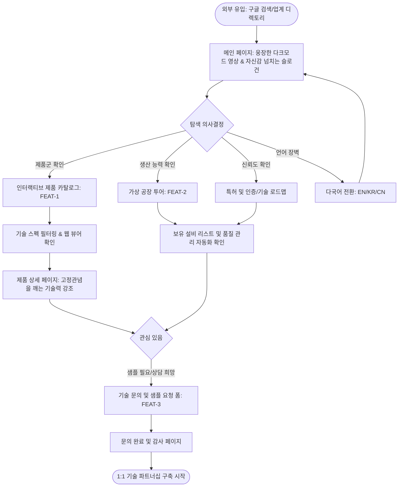

# [User Flow] 썬텍 홈페이지 사용자 여정

## 1. 개요
본 흐름도는 구매팀 연구원이 새로운 부품 협력사를 검토하기 위해 썬텍 홈페이지에 유입되어 기술력을 검증하고 최종적으로 문의를 남기기까지의 과정을 시각화합니다.

## 2. 주요 시나리오: 부품 협력사 선정 검토

## 3. 사용자 단계별 심리 상태 및 목표

### Step 1: 첫 인상 (메인 페이지)
- **목표:** 사이트의 세련된 디자인으로 "이 회사는 급이 다르구나"라는 인상을 줌.
- **심리:** 호기심 및 글로벌 체급 확인.

### Step 2: 기술 검증 (카탈로그 & 공장 투어)
- **목표:** 필요한 부품이 있는지, 실제로 대량 생산이 가능한지 팩트 체크.
- **심리:** 비판적 사고, 꼼꼼한 데이터 대조.

### Step 3: 확신 및 행동 (문의하기)
- **목표:** "함께 일하고 싶다"는 확신을 얻고 실무 컨택 포인트 확보.
- **심리:** 비즈니스 파트너십에 대한 기대감.
